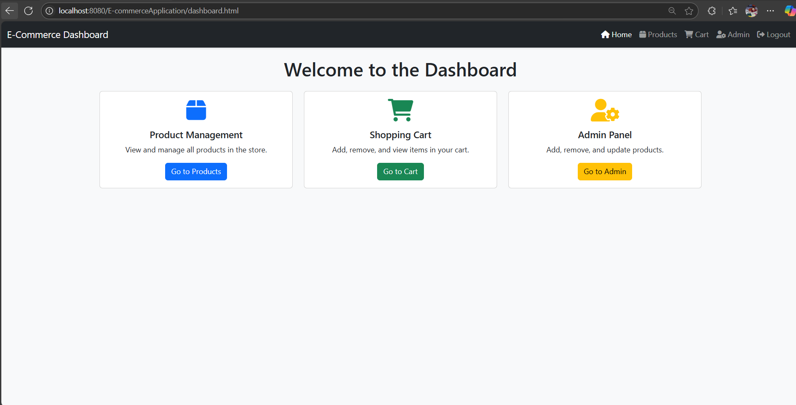

# 🛒 Full-Stack eCommerce Web Application

A full-featured eCommerce web application developed using **Java (NetBeans)**, **JSP**, and **MySQL**, providing a complete shopping experience with robust backend functionality.

---

## **Project Description**

This project demonstrates the development of a dynamic, full-stack eCommerce platform that allows:

✔ User Registration and Login  
✔ Product Management (CRUD Operations)  
✔ Shopping Cart Functionality  
✔ Database Integration using **JDBC**  
✔ Responsive Frontend using **HTML, CSS, JSP**  

---
## 📊 Application Dashboard

##  **Tools & Technologies Used**

- **NetBeans IDE** – Java project development
- **Java, JSP, Servlets** – Backend logic
- **HTML, CSS, JavaScript** – Frontend interface
- **MySQL** – Database management
- **WampServer** – Local development server
- **JDBC** – Database connectivity

---

## **Key Features**

- User Signup and Login with session management  
- Product listing with Create, Read, Update, Delete (CRUD) functionalities  
- Shopping cart with add/remove product options  
- Secure and efficient database operations using **JDBC**  
  

---

